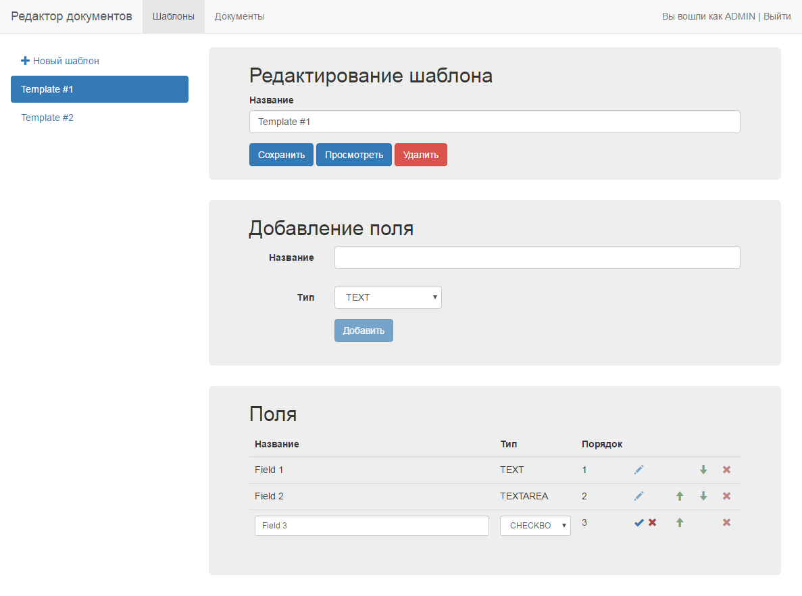

# Document Editor Frontend

Angular 2 RC5 + JWT frontend for Simple Document Editor

This project was generated with [angular-cli](https://github.com/angular/angular-cli) version 1.0.0-beta.11-webpack.8.

## Getting Started

##### Backend.
run [Documents Spring Boot App](https://github.com/wjke/document-editor-backend-spring)

##### Frontend.
```
ng serve
open http://localhost:4200/
```

## Screenshot



## License

[MIT](/LICENSE)